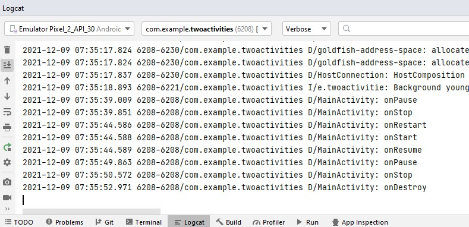

# lifecycle-state

## Table of contents
* [General info](#general-info)
* [Technologies](#technologies)

## General info
This project is a part of learning course at British College Kathmandu.
	
## Technologies
Project is created with:
* Android Studio
* Java
	
#### Here is the Screenshot for the Lifecycle and State App which has onPause, onStop, onRestart, onStart, onResume, onPause, onStop, onDestroy 

